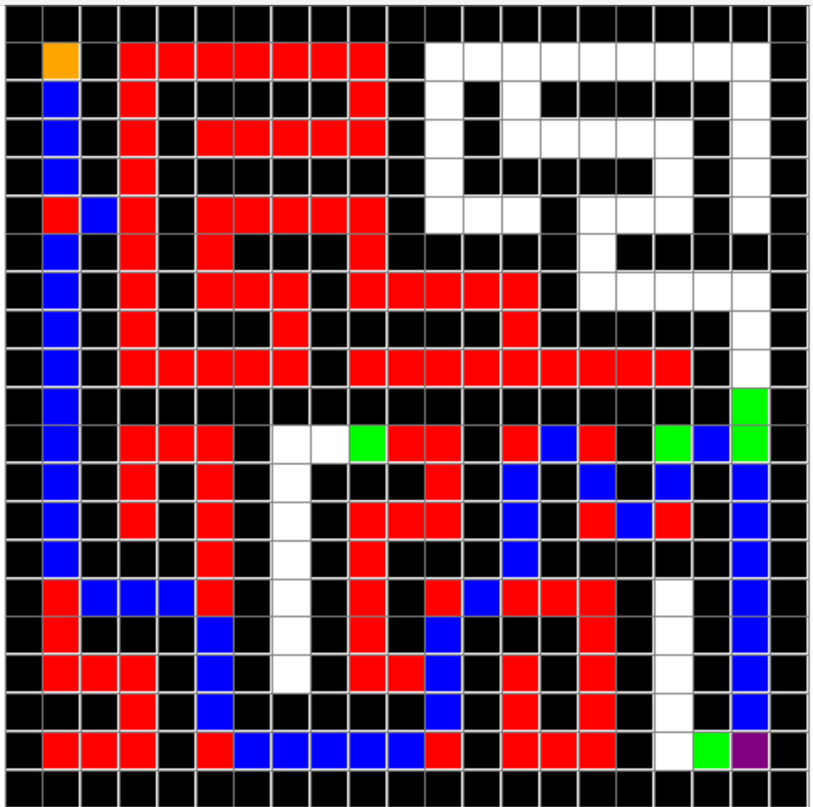

# a_star_path_finding

Graphical implementation of the A* path-finding algorithm using Python and Pygame. It includes a random maze generator for perfect mazes.

## Options (Key Map)

1. Standard User Interface - Instant Response:
    - Press **Q** to quit.
    - Press **P** to toggle between seeing the algorithm instantly, step by step, or hiding the algorithm.
    - Press **L** to toggle between seeing the maze generation or hiding the maze generator work.

2. Rest - Response Only in Graph Creation Mode (Not Available During Algorithm Work):
    - Press **O** to enable or disable diagonal connections.
    - Press **R** to reset the algorithm while keeping the board.
    - Press **C** to reset the entire board.
    - Press **SPACE** to start the algorithm.
    - Press **G** to generate a maze.
    - Press **F** to loop maze generation and solving with animations.

## Color Map

- Orange: Starting node
- Purple: End node
- Black: Barriers
- Green: Open nodes (nodes that the algorithm considered but didn't check yet)
- Red: Closed nodes (nodes that the algorithm visited directly)
- Blue: Shortest path nodes

To change the graph size:
- Change the integer value of `Settings().ROWS` to modify the number of graph rows.
- Change the integer value of `Settings().COLS` to modify the number of graph columns.

To change the window size (in pixels):
- Change the integer value of `Settings().WIDTH` to modify the x window dimension.
- Change the integer value of `Settings().HEIGHT` to modify the y window dimension.

The `a_star_path_finding` project provides a visual representation of the A* path-finding algorithm and allows users to generate random mazes for testing the algorithm's effectiveness.
